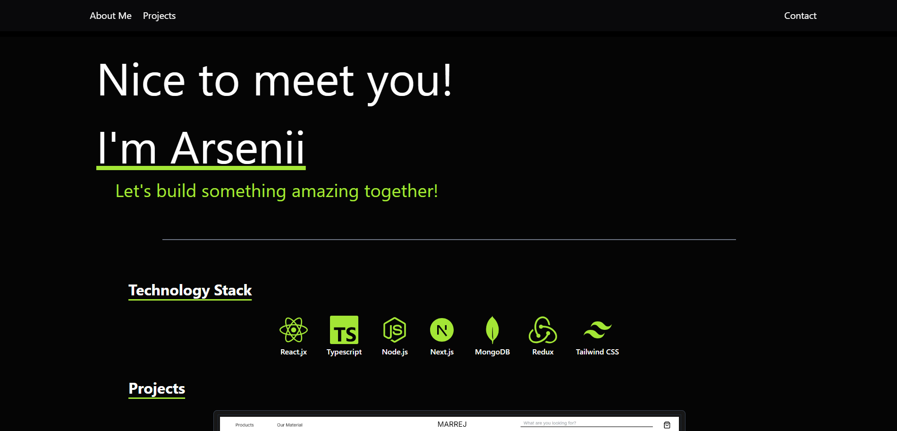
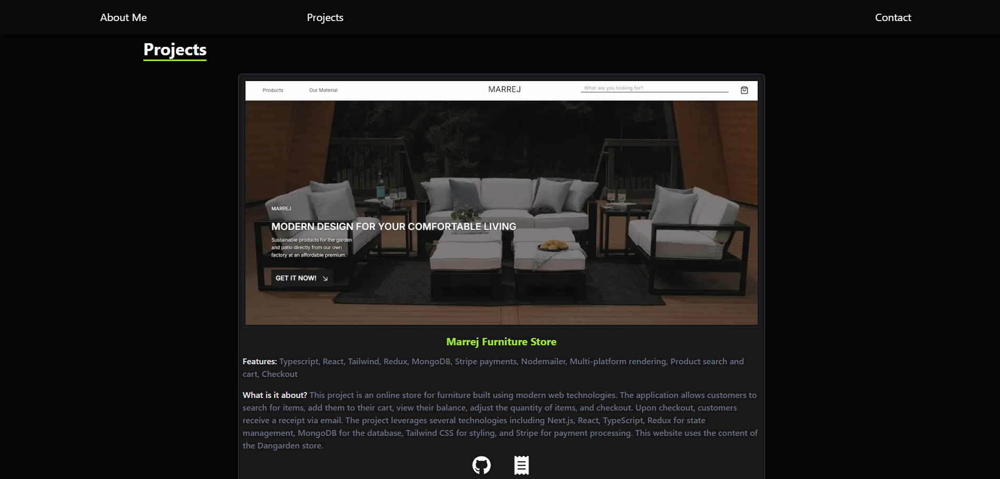
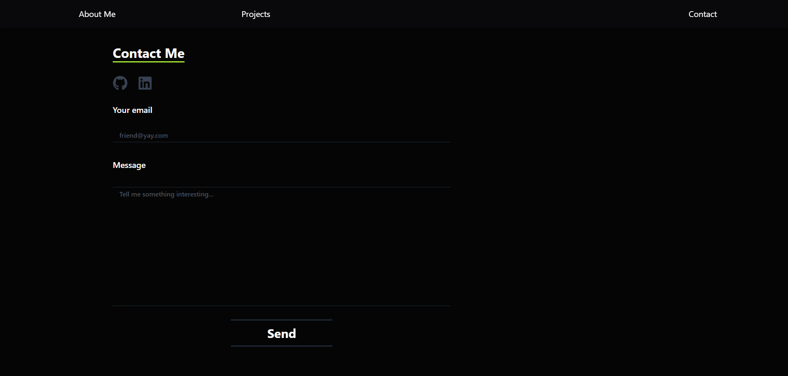

# My Portfolio

## Overview

Welcome to my portfolio site! This website showcases all my projects, including various pet websites I've developed. The site is built using modern web development technologies to ensure a smooth, responsive, and visually appealing user experience.

## Technologies Used

- **TypeScript**: For type safety and better developer experience.
- **Next.js**: For server-side rendering, static site generation, and overall enhanced performance.
- **React**: For building interactive and dynamic user interfaces.
- **Tailwind CSS**: For rapid styling and responsive design.
- **Nodemailer**: To enable users to contact me directly through the website.

## Features

### Project Showcase

- **Project Listings**: Display all my pet website projects with detailed descriptions, screenshots, and links to live demos.

### Contact Form

- **Nodemailer Integration**: Users can fill out a contact form to send me a message directly. The form uses Nodemailer to send emails to my inbox.
  
  

### Responsive Design

- **Multiplatform Support**: The site is designed to work seamlessly on all devices, including PCs, tablets, and phones.

